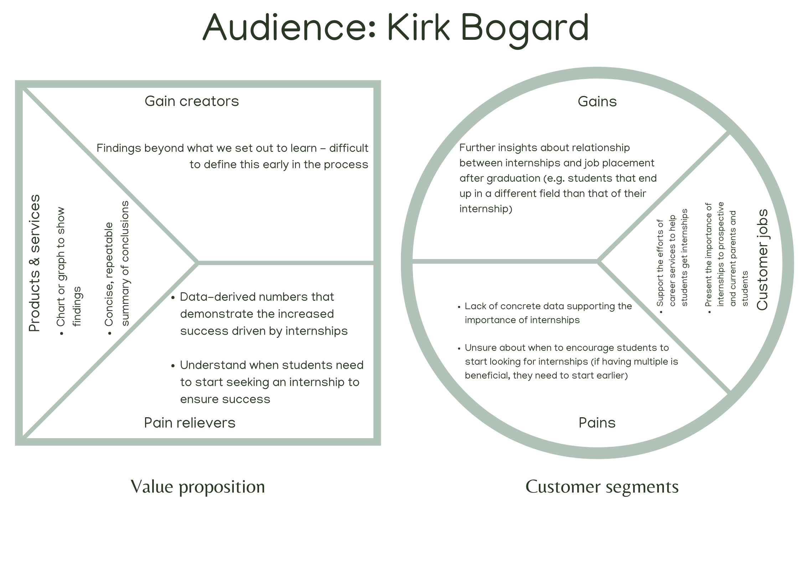

## **Description**

Annually, the FSB conducts a senior survey of graduates to learn of their employment status. In addition, information is verified using LinkedIn and employer survey information. The data file contains data on graduates for 2019, 2020, and 2021. The data are merged from two sources: the senior survey, and data from the Miami University database.

We intend to determine if there is correlation between student internships and job placement for students at the Farmer School of Business. Using the data provided by the client (Mr. Kirk Bogard), we will conduct an analysis to determine if there is a relationship. Ideally, we can provide a chart or graph of our findings in order to provide an easy visualization for students, career services staff, and prospective donors to understand the value that internships have upon post-graduate job placement. Thus, the primary goals are to:

-   determine the relationship between internships and post-grad job placement

-   communicate the results of the analysis in an easy to comprehend format that conveys the findings accurately

## **Business Value Proposition**

Below is a visual of the business value proposition created for this project.



## **Data Pre-Processing**

**Reading the Data**
```{r}
data = readRDS("FSB_BI_Survey_2019_2021.rds")
head(data)
```
**Data Description**

```{r}
install.packages("tidyverse")
library('tidyverse')
```
Data Structure:
```{r}
glimpse(data)
```

**Data Cleaning**


